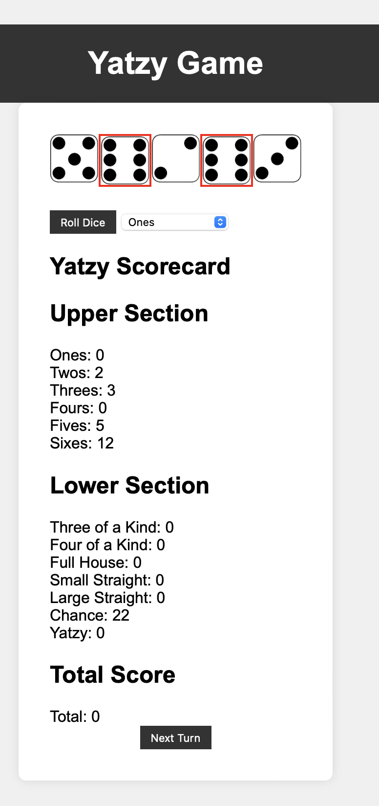
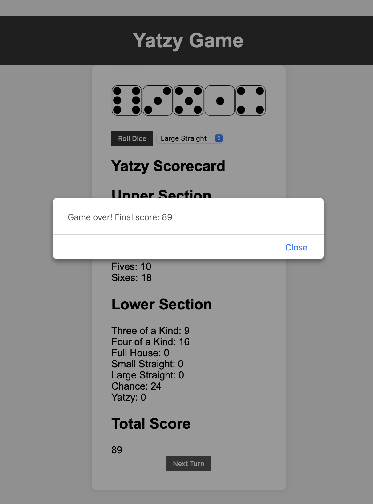

# Yatzy Game

Welcome to Groups  23 Yatzy game! This game is a digital version of the classic dice game Yatzy.

## How to Play

1. Click on the "Roll Dice" button to roll the dice.
2. Click on individual dice to hold/unhold them for the next roll.
3. You can roll the dice up to 3 times per turn.
	3a. After each roll the score that you can get within each category is listed below
4. After rolling, select a scoring category from the dropdown menu.
5. Click "Next Turn" to end your turn and score your selected category.
6. Dice are automatically rolled for you after you select next Turn
7. The game ends after all scoring categories are filled.

## You want to get the highest possible total Score!!

## Screenshots

## Project Structure

- `assets/` - Contains CSS and JavaScript files.
- `docs/design_system/` - Contains the design system documentation and related assets.
- `test.html` - The main HTML file.
- `README.md` - This file, which provides an overview of the project.

## Installation

To run the game locally, simply open `test.html` in your web browser.

